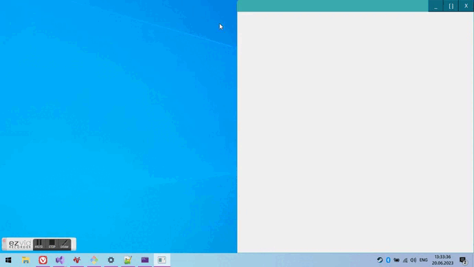

# frameless_window_qt
Cross-platform Frameless window with custom caption using Qt Widgets.

For now only windows version is working



## Build
To configure the project with a default configuration simply run confuguration script:

```
bash confugure_linux_default.sh Release
OR
configure_windows_default.bat Debug
```
